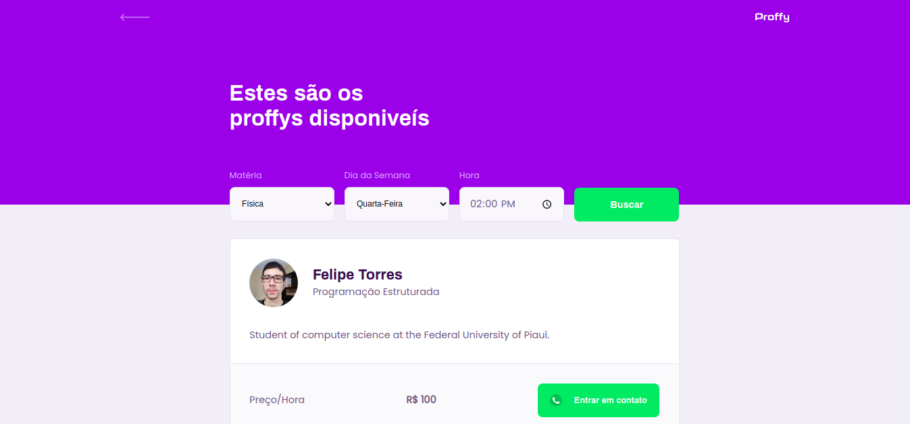
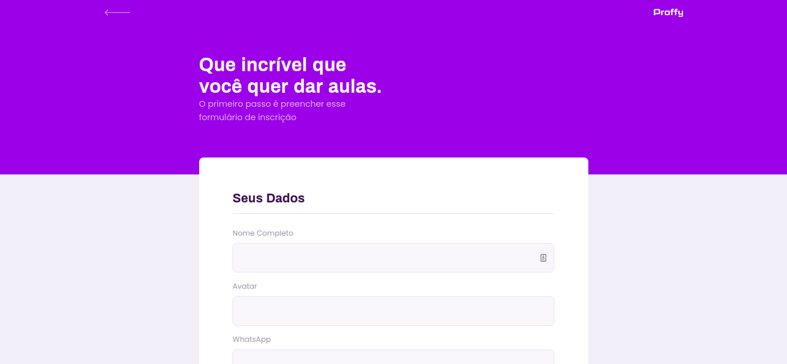

# Next Level Week - 2
O NLW é uma semana prática com muito código, desafios, networking e um único objetivo: levar o desenvolvedor ao próximo nível. O projeto é desenvolvido pela Rocketseat e inspira o aluno a avançar em seus objetivos. Este repositório contém os códigos do projeto desenvolvido na segunda edição da NLW. 

# Descrição
O projeto desenvolvido na segunda edição da NLW foi o Proffy, uma plataforma de estudo onde alunos podem se conectar a professores de determinadas matérias. O objetivo era desenvolver tanto o back-end da aplicação com NodeJS(Rest API) quando suas versões web(React) e mobile(React Native) integradas com o Typescript. Para o projeto mobile foi utilizado o expo como base de desenvolvimento.

# Como o projeto está atualmente

## Web - React com TypeScript

## Mobile - React Native com TypeScript

  
  
  
  

# Implementações Futuras

## Web - React com TypeScript

- [ ] Adicionar tela de sucesso após cadastrar um professor

## Mobile - React Native com TypeScript

- [ ] Implementar a tela de cadastro para professores.

# Desafios Sugeridos 

Notion: https://www.notion.so/Vers-o-2-0-Proffy-eefca1b981694cd0a895613bc6235970